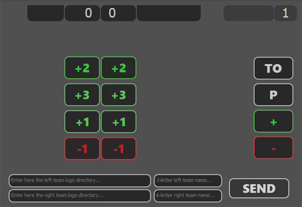
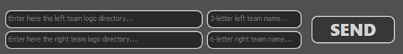
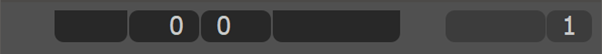
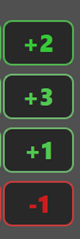
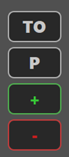

# __Basket Scoreboard__
 A simple scoreboard for Basket live games.
 
 

***

## __Download & Run__
 * Download the code and *open the* ***ScoreBoard.exe*** *app*
 * **Easy to run:** *Just open the app!*
***

## __Configure__
 * **Configure teams:** 
    * *First team can have name up to 3 chars*
    * *Second team can have name up to 6 chars*
    * *Team logos must have the size of 50x30 px*
    * *Upload the logo directories and only click `Send`*
    
 * **Done** with configuration!

***

## __Use__
 * **The score bar** (whithout team names)
    
 * **The score control buttons**
 
   

* **The period / timeout control buttons**
 
   

***
#### By: __Francisco Oliveira__
***

## __Enjoy!__

